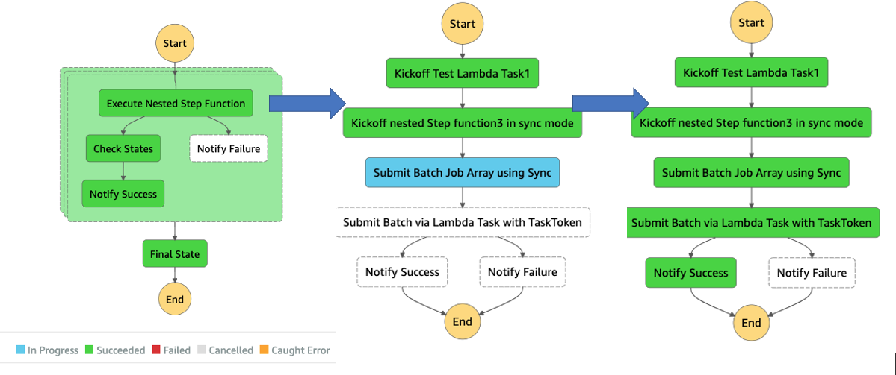

# aws-stepfunction-complex-orchestrator-app

This project contains source code and supporting files for a AWS Serverless application that you can deploy with the SAM CLI. It includes the following files and folders:

- functions - Code for the application's Lambda functions to invoke AWS Batch or act as a callback notifier to AWS Step Functions.
- statemachines - Definition for the AWS Step Functions that orchestrates the complex workflow of managing multiple nested AWS Batch jobs using waitForTaskToken callback mechanism and child Step Functions.
- template.yaml - A template that defines the application's AWS resources.

This application creates a mock orchestration of AWS Batch jobs using Step Functions. It demonstrates the power of Step Functions to orchestrate AWS Batch, Lambda functions and other AWS resources to form complex and robust workflows, using Map for parallel execution, child step functions for overcoming step function execution limits (25K execution history) while demonstrating waitForTaskToken callback pattern to handle dynamic completion rather than polling for job status as well as templating everything using SAM.

AWS Step Functions lets you coordinate multiple AWS services into serverless workflows so you can build and update apps quickly. Using Step Functions, you can design and run workflows that stitch together services, such as AWS Lambda, AWS Fargate, and Amazon SageMaker, into feature-rich applications.

The application uses several AWS resources, including Step Functions state machines, Lambda functions and AWS Batch. These resources are defined in the `template.yaml` file in this project. You can update the template to add AWS resources through the same deployment process that updates your application code.




## Requirements

The AWS Batch jobs are run using Fargate. This requires a VPC (can be default vpc) and subnet(s) association as part of the compute environment for Fargate.

Please provide a valid VPC id and a comma separated list of public subnets ids when requested by the SAM tool during deploy with guided option.

If using private subnets, ensure vpc has a NAT gateway to allow Fargate to reach out to internet.
If using public subnets, uncomment the NetworkConfiguration and AssignPublicIp configuration inside the template.yaml file to allow Public IPs for the Fargate containers.
```
        FargatePlatformConfiguration:
          PlatformVersion: "1.4.0"
        # Fargate instance needs to access internet to connect to Docker Hub in order to pull docker image.
        # If deploying on VPC with only private subnets, ensure VPC has NAT gateway associated with its public subnets and default route to NAT to allow outbound.
        # else enable public ip if going with public subnets.
        #NetworkConfiguration:
        #  AssignPublicIp: "ENABLED"
```

Additionally, please copy over the provided batch script (batch-notify-step-function.sh file under batch-script folder) into a newly generated S3 bucket (after running `sam deploy` successfully as detailed in the deploy steps). This script should be available in newly generated S3 bucket location before starting the test.

## Deploy the sample application

The Serverless Application Model Command Line Interface (SAM CLI) is an extension of the AWS CLI that adds functionality for building and testing Lambda applications. It uses Docker to run your functions in an Amazon Linux environment that matches Lambda.

To use the SAM CLI, you need the following tools:

* SAM CLI - [Install the SAM CLI](https://docs.aws.amazon.com/serverless-application-model/latest/developerguide/serverless-sam-cli-install.html)
* [Python 3.8 installed](https://www.python.org/downloads/)
* Docker - [Install Docker community edition](https://hub.docker.com/search/?type=edition&offering=community)

Note: Docker not really required if there is no local dev/test using sam local option.
Switch to different version of Python if necessary by changing version information inside the sam template file (template.yaml)

Need following information when running sam deploy:
* VPC ID - Existing VPC where the AWS Batch would run
* Subnets - Subnets belonging to the VPC where Fargate Compute envs would be created.

*Note:* Check the `Requirements` on using private vs public subnets and steps to enable internet access for the Fargate containers.


The `sam build` command will build the source of your application. The `sam deploy --guided` command will package and deploy your application to AWS, with a series of prompts:

* **Stack Name**: The name of the stack to deploy to CloudFormation. This should be unique to your account and region, and a good starting point would be something matching your project name.
* **AWS Region**: The AWS region you want to deploy your app to.
* **BatchScriptName**: `batch-notify-step-function.sh` - default script provided already (available under batch-script folder)
* **VPCID**: ID of an existing VPC which would be used to provide Fargate based compute environment for the AWS Batch Jobs. This should have subnets. If using private subnet, ensure it has NAT Gateway for internet access.
* **FargateSubnetAccessibility**: Specify whether Private or Public Subnets would be used for deploying Batch Jobs as Fargate Containers (that need internet access for pulling the docker images). Valid inputs are `Private` (default, requires NAT Gateway to access internet) or `Public` (which would enable Public IP for the Fargate Container).
* **Subnets**: comma separated list of private or public subnet ids within the above VPC.
* **Confirm changes before deploy**: If set to yes, any change sets will be shown to you before execution for manual review. If set to no, the AWS SAM CLI will automatically deploy application changes.
* **Allow SAM CLI IAM role creation**: Many AWS SAM templates, including this example, create AWS IAM roles required for the AWS Lambda function(s) included to access AWS services. By default, these are scoped down to minimum required permissions. To deploy an AWS CloudFormation stack which creates or modifies IAM roles, the `CAPABILITY_IAM` value for `capabilities` must be provided. If permission isn't provided through this prompt, to deploy this example you must explicitly pass `--capabilities CAPABILITY_IAM` to the `sam deploy` command.
* **Save arguments to samconfig.toml**: If set to yes, your choices will be saved to a configuration file inside the project, so that in the future you can just re-run `sam deploy` without parameters to deploy changes to your application.

To build and deploy your application for the first time, run the following in your shell:

```bash
git clone https://github.com/aws-samples/aws-stepfunction-complex-orchestrator-app
cd aws-stepfunction-complex-orchestrator-app

# Run this first and subsequently on making changes to code/templates
sam build
# Check the parameter details
sam deploy --guided

# Need to be run just once after sam deploy was successful unless changes were made to the batch script.
aws s3 cp ./batch-script/batch-notify-step-function.sh <S3-bucket-created-by-sam>
```

## Deployment output
At end of the deployment, one should see similar outputs specifying the Batch script location (with s3 bucket name), main orchestrator step function and other resources.
```
---------------------------------------------------------------------------------------------------------------------------------------------------------
Outputs
---------------------------------------------------------------------------------------------------------------------------------------------------------
Key                 BatchJobDefnArn
Description         Arn of the AWS Batch Job Definition created
Value               arn:aws:batch:us-west-2:xxxxxx:job-definition/sample-batch-job-defn-sample-orchestrator:1

Key                 BatchJobDefnScriptPath
Description         Complete path to the sample AWS Batch script (to be uploaded) with s3 bucket name.
Value               s3://sample-orchestrator-s3bucket-pl2323sd/batch-notify-step-function.sh

Key                 BucketName
Description         Name of the generated Amazon S3 bucket
Value               sample-orchestrator-s3bucket-pl2323sd

Key                 BatchJobQueueArn
Description         Arn of the AWS Batch queue where jobs would be submitted
Value               arn:aws:batch:us-west-2:xxxxxx:job-queue/job-queue-sample-orchestrator

Key                 ComplexOrchestratorStateMachine
Description         Main Orchestrator State machine to run
Value               ComplexOrchestratorStateMachine1-pDlfR0UAz6xG
```
Ensure copy of the *batch-notify-step-function.sh* script gets copied into the location specified by `BatchJobDefnScriptPath` before starting the actual testing.

```
 # Replace the s3 bucket to match one generated
 aws s3 cp batch-script/batch-notify-step-function.sh  s3://<sample-orchestrator-s3bucket>/batch-notify-step-function.sh
```

## Testing

Use the sample payloads (available under test-inputs) to test the individual AWS Step Functions or Lambda Functions. Start the test with the main `ComplexOrchestratorStateMachine1-xyz..` Step function. The sample payload for the main orchestrator step function has 2 input elements within the entries array and this would make it create and execute 2 child step functions in parallel. This can be modified to make it execute more children in parallel. Each child step function is expected to take atmost 3 minutes to complete (30 seconds wait for the callback_notify_step_function3 while the AWS Batch job takes about 20 seconds controlled by settings in orchestrator step function's sleep_interval attribute passed to child step function payload). Click the child step functions to follow their individual executions or step through the AWS Lambda or AWS Batch Executions.

If the AWS Batch job fails or if the step functions timed out, then the issue is due to missing batch script in the S3 bucket.
Copy over the batch script into the s3 bucket generated as shown in Deployment.

AWS Batch jobs can also fail trying to connect to Internet to pull down Docker images: either Public IP is disabled for the Fargate container when running on public subnet or no NAT access when running on private subnet (Check for errors: CannotPullContainerError: inspect image has been retried 5 time). Edit the parameters when running sam deploy to go with `Public` subnets that would enable Public IP for the Fargate container or select `Private` if deciding to deploy on private subnets that have NAT for Internet access.

Whenever making changes to the code or SAM templates, rerun the sam build followed by sam deploy.

## Cleanup

To delete the sample application that you created, use the AWS CLI. First delete the S3 bucket hosting the batch script. Assuming you used your project name for the stack name, you can run the following:

```
bash
aws s3 rm s3://<sample-orchestrator-s3bucket> --recursive
aws cloudformation delete-stack --stack-name <stack-name>
```

## Resources

See the [AWS SAM developer guide](https://docs.aws.amazon.com/serverless-application-model/latest/developerguide/what-is-sam.html) for an introduction to SAM specification, the SAM CLI, and serverless application concepts.


## Security

See [CONTRIBUTING](CONTRIBUTING.md#security-issue-notifications) for more information.

## License

This library is licensed under the MIT-0 License. See the [LICENSE](LICENSE) file.
